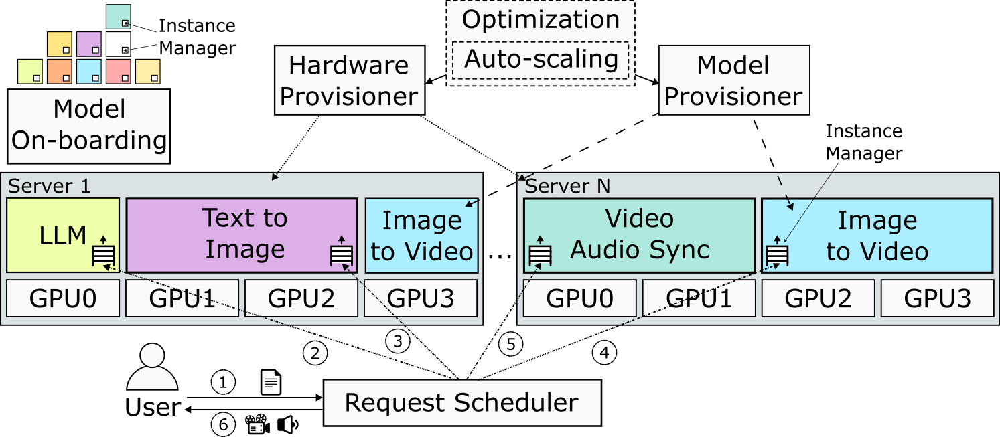

# 📄🔉 Real-Time Video Generation 📽️🖼️
Modular, adaptive serving stack for real-time multi-modal generation (e.g., video, audio, images).
It dynamically balances latency, cost, and quality, and supports both streaming generation (real-time playback) and offline workloads.

It uses a cluster manager called StreamWise.
We have implemented [multiple applications](apps/README.md) that run on top of StreamWise.
For example, [StreamCast](apps/README.md) is an application that generates real-time video podcasts from input documents (e.g., PDFs).

---

> [!IMPORTANT]
>
> This project focuses on **systems research** — specifically the infrastructure, scheduling, provisioning, and serving aspects of multi-modal generation workloads.
> The application workloads are used to **stress-test and evaluate the system**, not to assess or guarantee the quality of the generated content.
> Outputs may not be inconsistent, contain visual artifacts, or otherwise degraded — this is irrelevant to the research goals.
> This project is not designed for production purposes.

---

## 🚀 Features
- Model on-boarding for 25+ multi-modal models (video, audio, image, LLMs)
- Provisioning of GPUs, replicas, and model variants
- Deadline-aware request scheduler for streaming workloads
- Adaptive quality (resolution, FPS, sampling steps)
- Multi-GPU + cross-region support
- Spot-aware optimization to reduce cost
- Caching, batching, and GPU frequency scaling

---

## 🏗 Architecture
It consists of:
- **Model on-boarding**: packaging and standardizing multi-modal models  
- **Provisioning**: selecting hardware, GPUs, and model replicas  
- **Scheduling**: orchestrating requests under latency constraints  
- **Execution**: running requests efficiently inside a model instance  




### 📦 Model wrapper and on-boarding
We package each model as a Docker container, based on an [NVIDIA image](https://hub.docker.com/layers/nvidia/cuda/12.9.1-cudnn-devel-ubuntu24.04/images/) with GPU drivers and runtime tools.
Each container embeds our _Instance Manager_, which standardizes the interface for executing inference requests.
We adapt existing inference code (typically from [Hugging Face](https://huggingface.co/models)) to this interface and bundle it with the model weights.
A Python wrapper exposes an HTTP endpoint for existing multi-modal generation models (e.g., [Flux](https://github.com/black-forest-labs/flux) or [Wan](https://github.com/Wan-Video/Wan2.1)).
It allows triggering multi-modal generations (e.g., video from text) and collect statistics.
The manager also handles request batching and adjusts GPU frequencies to optimize resource usage.

For the complete list of wrapped models with full details and classification, see [Model Wrapper documentation](docs/model_wrapper.md#models).

The characteristics for each model are in ([services.json](services.json)).
These characteristics include quality ([Elo ranking](https://huggingface.co/spaces/ArtificialAnalysis/Text-to-Image-Leaderboard)), frame rate (FPS), maximum number of frames (video length), number of attention heads, VAE compression ratios, supported resolutions, and other relevant attributes.
More details [here](docs/model_wrapper.md).


### ⚙️ Provisioning hardware and models
We frame hardware and model selection for a workload (e.g., a 10-minute medium-quality video podcast) as an optimization problem.
After selecting a configuration, the hardware and model provisioners handle setup accordingly.
More details [here](docs/provisioning.md).

### 📅 Request scheduler
The request scheduler orchestrates execution using a live, iterative version of our greedy algorithm informed by the request DAG.
More details [here](docs/scheduler.md).


### ⚙️ Applications
We implemented multiple workflows for multi-modal generation.
More details [here](apps/README.md).


## 🚀 Deployment
We build StreamWise on top of a [Kubernetes (K8s)](https://kubernetes.io/) cluster:
a widely adopted cluster manager that enables modular deployment, auto-scaling, service discovery, and fault tolerance.
More details [here](deployment/README.md).

### ☸️ Kubernetes
Our Docker containers to run on [K8s](https://kubernetes.io/).

#### ☁️ Azure Kubernetes Service (AKS)
To deploy on [Azure Kubernetes Service (AKS)](https://learn.microsoft.com/en-us/azure/aks/what-is-aks) follow the instructions [here](deployment/aks/README.md).


## 📄 Citation
If you use StreamWise in research, please cite:
```bibtex
@article{streamwise2026,
  title={{StreamWise: Adaptive Serving for Real-Time Multi-Modal Generation}},
  author={Haoran Qiu, Gohar Irfan Chaudry, Chaojie Zhang, Íñigo Goiri, Esha Choukse, Rodrigo Fonseca, Ricardo Bianchini},
  journal = {arXiv:2603.05800},
  year={2026}
}
```

## 🤝 Contributing
Pull requests are welcome! Please open an issue for major changes.
More details [here](CONTRIBUTING.md).

## 📜 License
[MIT License](LICENSE).
